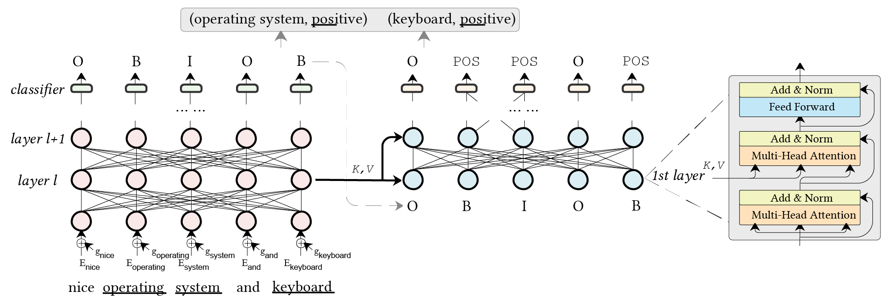

# GRACE

The implementation of Findings of EMNLP 2020 paper titled 

[GRACE: Gradient Harmonized and Cascaded Labeling for Aspect-based Sentiment Analysis](https://arxiv.org/abs/2009.10557). Huaishao Luo, Lei Ji, Tianrui Li, Nan Duan, Daxin Jiang. Findings of EMNLP, 2020.

This paper proposes a GRadient hArmonized and CascadEd labeling model (GRACE) to solve aspect term extraction (ATE) and aspect sentiment classification (ASC) tasks. The imbalance issue of labels in sentiment analysis is involved in this paper.

The main structure of our GRACE.


## Requirements

* python 3.6
* pytorch==1.3.1

## Pretrained Weight
The pretrained weight can be found in the folder of [**pretrained_weight**](./pretrained_weight). 

## Running
Finetune the ATE part firstly, then finetune the ATE + ASC. Execute the following four step to reproduce the results of the paper.

**0. Set Path**
```
DATA_NAME=lap
VAT_NUM=1
PRETRAINED_WEIGHT=pretrained_weight/pytorch_model.bin
```
*DATA_NAME can be set as `lap` for laptop 2014, `res` for union set of restaurant reviews, `res{2014|2015|2016}` for restaurant 2014, 2015, 2016, respectively, `twt{0|1|2|3|4|5|6|7|8|9}` for ten-fold cross-validation for twitter. Set VAT_NUM to 3 if testing on other datasets instead of `lap`. See [the paper](https://arxiv.org/abs/2009.10557) for more details.*

Note: `res` may not be a valid dataset because this union version contains overlap samples between the training set and the testing set. It is a historical question on research line. So, it suggests using the `res{2014|2015|2016}` for comparison. The results on `lap` and `twt{0-9}` are NOT affected.

**1. ATE - with GHL (Gradient Harmonized Loss)**
```
CUDA_VISIBLE_DEVICES=0 python ate_run.py --do_train --do_eval \
--data_dir=data/ --data_name=${DATA_NAME} --output_dir=out_${DATA_NAME} \
--bert_model=bert-base-uncased --do_lower_case \
--max_seq_length=128 --warmup_proportion=0.1 \
--train_batch_size 32 --num_train_epochs 5 --learning_rate 3e-5 \
--use_ghl --init_model ${PRETRAINED_WEIGHT}
```

**2. ATE - with GHL + VAT (Gradient Harmonized Loss \& Virtual Adversarial Training)**
```
CUDA_VISIBLE_DEVICES=0 python ate_run.py --do_train --do_eval \
--data_dir=data/ --data_name=${DATA_NAME} --output_dir=out_${DATA_NAME} \
--bert_model=bert-base-uncased --do_lower_case \
--max_seq_length=128 --warmup_proportion=0.1 \
--train_batch_size 32 --num_train_epochs ${VAT_NUM} --learning_rate 1e-5 \
--use_ghl --use_vat --init_model out_${DATA_NAME}/pytorch_model.bin.4
```

**3. ATE + ASC - with GHL + VAT (Gradient Harmonized Loss \& Virtual Adversarial Training)**
```
CUDA_VISIBLE_DEVICES=0 python ate_asc_run.py --do_train --do_eval \
--data_dir=data/ --data_name=${DATA_NAME} --output_dir=out_${DATA_NAME}_ateacs \
--bert_model=bert-base-uncased --do_lower_case \
--max_seq_length=128 --warmup_proportion=0.1 \
--train_batch_size 32 --num_train_epochs 10 --learning_rate 3e-6 \
--use_ghl --init_model out_${DATA_NAME}/pytorch_model.bin.$((VAT_NUM-1))
```

## Citation

If this work is helpful, please cite as:

```
@Inproceedings{Luo2020grace,
    author = {Huaishao Luo and Lei Ji and Tianrui Li and Nan Duan and Daxin Jiang},
    title = {GRACE: Gradient Harmonized and Cascaded Labeling for Aspect-based Sentiment Analysis},
    booktitle = {Findings of EMNLP},
    year = {2020}
}
```

## Acknowledgements

Our code is based on the implementation of [transformers](https://github.com/huggingface/transformers) and [SpanABSA](https://github.com/huminghao16/SpanABSA)
